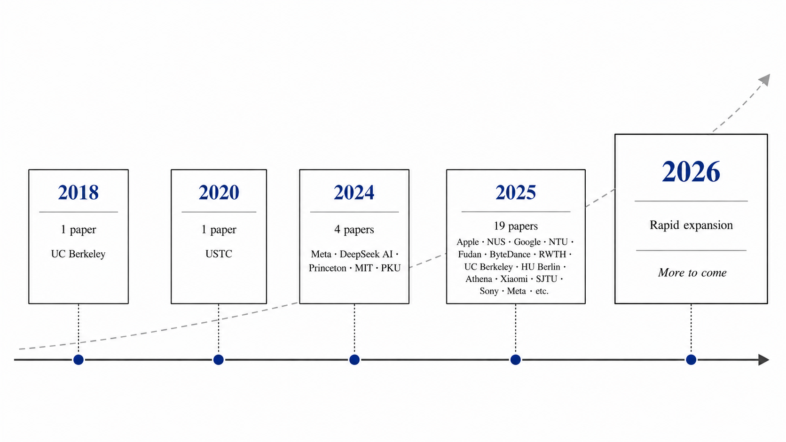

#   Awesome Multi-Token Prediction (MTP!)

> *A curated list of papers, tools, and resources on Multi-Token Prediction (MTP) and related techniques in Large Language Models (LLMs), Speech-Language Models (SLMs), and more.*

Multi-Token Prediction (MTP) is an emerging paradigm that enhances the efficiency and capability of language and multimodal models by allowing them to predict multiple tokens simultaneously. This repository collects recent research and implementations in this exciting direction.

---

Venue information is included only when it is confirmed by official proceedings, an official conference program, or the paper's current metadata. Unpublished works are labeled as arXiv preprints or technical reports. Year sections follow the formal publication year when available; otherwise, they use the first public release year.

## 🔬 Recent Papers (2026)

| Title | Institution | Venue | Paper | Code |
|------|-------------|------|-------|------|
| **LoopMTP: A looped transformer guided by latent multi-token prediction** | Lamarr Institute / University of Bonn / Fraunhofer IAIS | arXiv 2026 | [arXiv](https://arxiv.org/abs/2608.03624) | - |
| **AdaMTP: An Adaptive Training Paradigm for Multi-Token Prediction** | CUHK | arXiv 2026 | [arXiv](https://arxiv.org/abs/2608.00434) | - |
| **AngelSpec: Towards Real-World High Performance Inference with Speculative Decoding** | Tencent | arXiv 2026 | [arXiv](https://arxiv.org/abs/2607.25852) | [Code](https://github.com/Tencent/AngelSpec) |
| **Windowed-MTP: Removing the Full-Context Draft-KV Tax at Million-Token Context** | NVIDIA | arXiv 2026 | [arXiv](https://arxiv.org/abs/2607.21535) | [Code](https://github.com/avalliappan-nvidia/windowed-mtp-b200) |
| **K-Forcing: Joint Next-K-Token Decoding via Push-Forward Language Modeling** | Alibaba DAMO Academy / Hupan Lab / Zhejiang University / HKUST | arXiv 2026 | [arXiv](https://arxiv.org/abs/2606.10820) | [Code](https://github.com/alibaba-damo-academy/K-Forcing) |
| **Pair-In, Pair-Out: Latent Multi-Token Prediction for Efficient LLMs** | Renmin University of China | arXiv 2026 | [arXiv](https://arxiv.org/abs/2605.27255) | [Code](https://github.com/RedAI-Infra/PIPO) |
| **BitLM: Unlocking Multi-Token Language Generation with Bitwise Continuous Diffusion** | SJTU / MMLab CUHK / CAS | arXiv 2026 | [arXiv](https://arxiv.org/abs/2605.11577) | - |
| **How Transformers Learn to Plan via Multi-Token Prediction** | UCLA / SJTU / UPenn / RIKEN AIP | COLM 2026 | [arXiv](https://arxiv.org/abs/2604.11912) | - |
| **Toward Consistent World Models with Multi-Token Prediction and Latent Semantic Enhancement** | Shenzhen University / Microsoft Research Asia | ACL 2026 | [ACL Anthology](https://aclanthology.org/2026.acl-long.618/) | [Code](https://github.com/QiminZhong/LSE-MTP) |
| **Self-Distillation for Multi-Token Prediction** | Tencent | arXiv 2026 | [arXiv](https://arxiv.org/abs/2603.23911) | - |
| **Efficient Training-Free Multi-Token Prediction via Embedding-Space Probing** | Qualcomm AI Research | ICML 2026 | [arXiv](https://arxiv.org/abs/2603.17942) | - |
| **Efficient Document Parsing via Parallel Token Prediction** | Tencent / Renmin University of China | CVPR 2026 Findings | [arXiv](https://arxiv.org/abs/2603.15206) | - |
| **Beyond Token-Level Policy Gradients for Complex Reasoning with Large Language Models** | HIT / Baidu | arXiv 2026 | [arXiv](https://arxiv.org/abs/2602.14386) | - |
| **DFlash: Block Diffusion for Flash Speculative Decoding** | z-lab | ICML 2026 | [arXiv](https://arxiv.org/abs/2602.06036) | [Code](https://github.com/z-lab/dflash) |
| **Multi-Token Prediction via Self-Distillation** | University of Maryland | ICML 2026 | [arXiv](https://arxiv.org/abs/2602.06019) | [Code](https://github.com/jwkirchenbauer/mtp-lm) |
| **Temporal Guidance for Large Language Models** | NUAA | arXiv 2026 | [arXiv](https://arxiv.org/abs/2601.21744) | - |
| **Parallel Token Prediction for Language Models** | UC Irvine / CZI / Pyramidal AI | ICLR 2026 | [arXiv](https://arxiv.org/abs/2512.21323) | [Code](https://github.com/mandt-lab/ptp) |
| **Peeking Into The Future For Contextual Biasing** | Samsung Research America | ICASSP 2026 | [arXiv](https://arxiv.org/abs/2512.17657) | - |
| **Fast and Expressive Multi-Byte Prediction with Probabilistic Circuits** | University of Edinburgh | ICML 2026 | [arXiv](https://arxiv.org/abs/2511.11346) | - |
| **Beyond Multi-Token Prediction: Pretraining LLMs with Future Summaries** | Mila / CMU / FAIR at Meta | ICLR 2026 | [arXiv](https://arxiv.org/abs/2510.14751) | - |
| **MTP-S2UT: Enhancing Speech-to-Speech Translation Quality with Multi-token Prediction** | NEU | ICASSP 2026 | [arXiv](https://arxiv.org/abs/2510.10003) | - |
| **Enhancing Visual Planning with Auxiliary Tasks and Multi-token Prediction** | Meta / UNC Chapel Hill | WACV 2026 | [CVF](https://openaccess.thecvf.com/content/WACV2026/html/Zhang_Enhancing_Visual_Planning_with_Auxiliary_Tasks_and_Multi-token_Prediction_WACV_2026_paper.html) | [Code](https://github.com/CeeZh/VideoPlan) |
| **What Makes a Good Speech Tokenizer for LLM-Centric Speech Generation? A Systematic Study** | Fudan University | AAAI 2026 | [AAAI](https://ojs.aaai.org/index.php/AAAI/article/view/40318) | [Code](https://github.com/cnxupupup/SLM-Decoupled-MTP) |

## 🔬 Recent Papers (2025)

| Title | Institution | Venue | Paper | Code |
|------|-------------|------|-------|------|
| **Next-Latent Prediction Transformers Learn Compact World Models** | Microsoft Research | arXiv 2025 | [arXiv](https://arxiv.org/abs/2511.05963) | [Code](https://github.com/JaydenTeoh/NextLat) |
| **MiMo-V2-Flash Technical Report** | Xiaomi | Technical Report 2025 | [Report](https://github.com/XiaomiMiMo/MiMo-V2-Flash) | [Code](https://github.com/XiaomiMiMo/MiMo-V2-Flash) |
| **FastMTP: Accelerating LLM Inference with Enhanced Multi-Token Prediction** | Tencent | arXiv 2025 | [arXiv](https://arxiv.org/abs/2509.18362) | [Code](https://github.com/Tencent-BAC/FastMTP) |
| **Your LLM Knows the Future: Uncovering Its Multi-Token Prediction Potential** | Apple | arXiv 2025 | [arXiv](https://arxiv.org/abs/2507.11851) | - |
| **Chain-of-Action: Trajectory Autoregressive Modeling for Robotic Manipulation** | ByteDance Seed | NeurIPS 2025 | [arXiv](https://arxiv.org/abs/2506.09990) | [Project Page](https://chain-of-action.github.io/) |
| **Improving Large Language Models with Concept-Aware Fine-Tuning** | NTU | arXiv 2025 | [arXiv](https://arxiv.org/abs/2506.07833) | [Code](https://github.com/michaelchen-lab/caft-llm) |
| **DONUT: A Decoder-Only Model for Trajectory Prediction** | RWTH Aachen University | ICCV 2025 | [CVF](https://openaccess.thecvf.com/content/ICCV2025/html/Knoche_DONUT_A_Decoder-Only_Model_for_Trajectory_Prediction_ICCV_2025_paper.html) | [Project Page](https://vision.rwth-aachen.de/DONUT) |
| **Generating Long Semantic IDs in Parallel for Recommendation** | UC San Diego / Meta AI | KDD 2025 | [arXiv](https://arxiv.org/abs/2506.05781) | [Code](https://github.com/facebookresearch/RPG_KDD2025) |
| **Pre-Training Curriculum for Multi-Token Prediction in Language Models** | Humboldt-Universität zu Berlin | ACL 2025 | [ACL Anthology](https://aclanthology.org/2025.acl-long.1243/) | [Code](https://github.com/aynetdia/mtp_curriculum) |
| **L-MTP: Leap Multi-Token Prediction Beyond Adjacent Context for Large Language Models** | NUS | NeurIPS 2025 | [arXiv](https://arxiv.org/abs/2505.17505) | [Code](https://github.com/Xiaohao-Liu/L-MTP) |
| **Multi-Token Prediction Needs Registers** | Athena Research Center | NeurIPS 2025 | [NeurIPS](https://proceedings.neurips.cc/paper_files/paper/2025/hash/56cbb9d0efc05fb9d266adbf00f8eba7-Abstract-Conference.html) | [Code](https://github.com/nasosger/MuToR) |
| **MiMo: Unlocking the Reasoning Potential of Language Model – From Pretraining to Posttraining** | Xiaomi | Technical Report 2025 | [arXiv](https://arxiv.org/abs/2505.07608) | [Code](https://github.com/XiaomiMiMo/MiMo) |
| **Roll the dice & look before you leap: Going beyond the creative limits of next-token prediction** (Outstanding Paper) | Google Research / CMU | ICML 2025 | [ICML](https://icml.cc/virtual/2025/poster/45769) | - |
| **GOAT-TTS: Expressive and Realistic Speech Generation via A Dual-Branch LLM** | TeleAI | arXiv 2025 | [arXiv](https://arxiv.org/abs/2504.12339) | - |
| **VocalNet: Speech LLMs with Multi-Token Prediction for Faster and High-Quality Generation** | SJTU | EMNLP 2025 | [ACL Anthology](https://aclanthology.org/2025.emnlp-main.989/) | - |
| **On multi-token prediction for efficient LLM inference** | Sony | ICLR 2025 Workshop (SLLM) | [ICLR](https://iclr.cc/virtual/2025/33508) | - |

---

## 📚 Earlier Works & Foundations

| Title | Institution | Venue | Paper | Code |
|------|-------------|------|-------|------|
| **DeepSeek-V3 Technical Report** | DeepSeek AI | Technical Report 2024 | [arXiv](https://arxiv.org/abs/2412.19437) | - |
| **Better & Faster Large Language Models via Multi-token Prediction** | Meta | ICML 2024 | [PMLR](https://proceedings.mlr.press/v235/gloeckle24a.html) | - |
| **ProphetNet: Predicting Future N-gram for Sequence-to-Sequence Pre-training** | USTC | Findings of EMNLP 2020 | [ACL Anthology](https://aclanthology.org/2020.findings-emnlp.217/) | - |

---

## 🧠 Speculative Decoding + MTP

| Title | Institution | Venue | Paper | Code |
|------|-------------|------|-------|------|
| **AngelSpec: Towards Real-World High Performance Inference with Speculative Decoding** | Tencent | arXiv 2026 | [arXiv](https://arxiv.org/abs/2607.25852) | [Code](https://github.com/Tencent/AngelSpec) |
| **Windowed-MTP: Removing the Full-Context Draft-KV Tax at Million-Token Context** | NVIDIA | arXiv 2026 | [arXiv](https://arxiv.org/abs/2607.21535) | [Code](https://github.com/avalliappan-nvidia/windowed-mtp-b200) |
| **DFlash: Block Diffusion for Flash Speculative Decoding** | z-lab | ICML 2026 | [arXiv](https://arxiv.org/abs/2602.06036) | [Code](https://github.com/z-lab/dflash) |
| **EAGLE-3: Scaling up Inference Acceleration of Large Language Models via Training-Time Test** | Peking University | NeurIPS 2025 | [NeurIPS](https://proceedings.neurips.cc/paper_files/paper/2025/hash/c7b5a35ea98b62512a869c19ea7b03cb-Abstract-Conference.html) | [Code](https://github.com/SafeAILab/EAGLE) |
| **Accelerating Codec-based Speech Synthesis with Multi-Token Prediction and Speculative Decoding** | KAIST | ICASSP 2025 | [arXiv](https://arxiv.org/abs/2410.13839) | [Project Page](https://mm.kaist.ac.kr/projects/mtp/) |
| **EAGLE: Speculative Sampling Requires Rethinking Feature Uncertainty** | Peking University | ICML 2024 | [PMLR](https://proceedings.mlr.press/v235/li24bt.html) | [Code](https://github.com/SafeAILab/EAGLE) |
| **Hydra: Sequentially-Dependent Draft Heads for Medusa Decoding** | MIT | COLM 2024 | [OpenReview](https://openreview.net/forum?id=FbhjirzvJG) | [Code](https://github.com/zankner/Hydra) |
| **Medusa: Simple LLM Inference Acceleration Framework with Multiple Decoding Heads** | Princeton University | ICML 2024 | [PMLR](https://proceedings.mlr.press/v235/cai24b.html) | [Code](https://github.com/FasterDecoding/Medusa) |
| **Blockwise Parallel Decoding for Deep Autoregressive Models** | UC Berkeley | NeurIPS 2018 | [NeurIPS](https://proceedings.neurips.cc/paper/2018/hash/c4127b9194fe8562c64dc0f5bf2c93bc-Abstract.html) | - |

---

## 🧩 Want to Contribute?

We welcome contributions! Please feel free to submit a PR or open an issue if you'd like to add new papers, tools, or correct any mistakes.

### ✅ Guidelines:
- Add relevant papers or projects related to MTP.
- Use consistent formatting.
- Include links where available.
